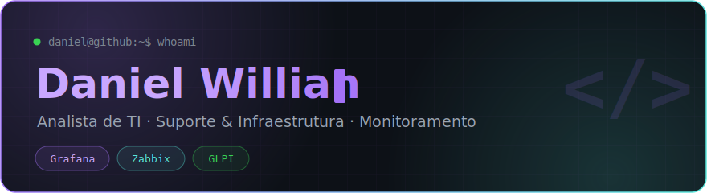
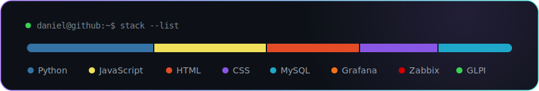

<!-- BANNER personalizado — fica no seu repositório, nunca quebra -->

  

  

 

<!-- STACK — card desenhado sob medida, fica no seu repositório, nunca quebra -->

  

 

<!-- TECNOLOGIAS — logos oficiais -->
<h3 align="center">🛠️ Tecnologias &amp; Ferramentas</h3>

  &nbsp;&nbsp;
  &nbsp;&nbsp;
  &nbsp;&nbsp;
  &nbsp;&nbsp;
  &nbsp;&nbsp;
  &nbsp;&nbsp;
  &nbsp;&nbsp;
  

 

<!-- SOBRE -->
<h3 align="center">🖥️ Sobre mim</h3>

  Sempre atuei na área de <b>Tecnologia da Informação</b>, com foco em suporte e infraestrutura. 
  Presto suporte e sustentação para <b>Grafana</b>, <b>Zabbix</b> e <b>GLPI</b>. 
  🌱 Sempre aprendendo novas ferramentas de monitoramento e automação.

 

<!-- CONTATO — logos de marca reais -->
<h3 align="center">📫 Fale comigo</h3>

  
  
  

